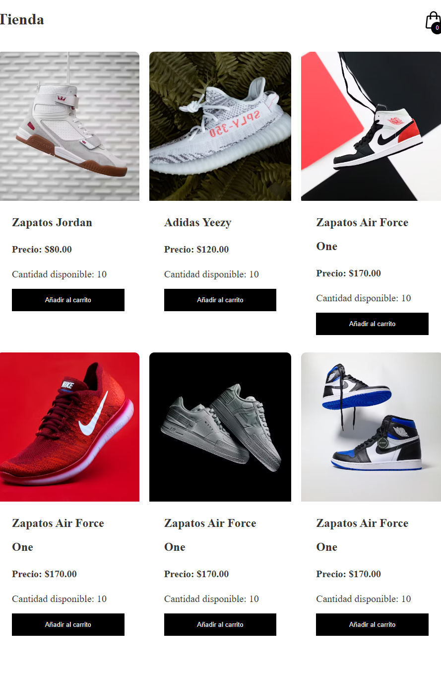
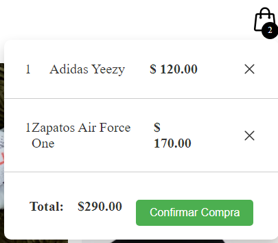

# Tienda de Zapatos

Este proyecto es una aplicación web de una tienda de zapatos desarrollada utilizando JavaScript. La aplicación proporciona una interfaz interactiva para que los usuarios exploren y compren zapatos.

## Características

- Catálogo de zapatos con imágenes y descripciones.
- Funcionalidad de carrito de compras.
- Proceso de pago simulado.
- Filtrado por categorías y tallas.

## Tecnologías Utilizadas

- JavaScript
- HTML
- CSS

## Capturas de Pantalla

_Catálogo de zapatos con opciones de filtrado._

_Vista del carrito de compras con resumen de la orden._

## Instrucciones de Instalación

1. Clona el repositorio: `git clone https://github.com/KevinEnriqueMartinezMartinez/Tienda-Javascript-DPS`
2. Abre el archivo `index.html` en tu navegador.

## Contribución

Si quieres contribuir, sigue estos pasos:

1. Haz un fork del proyecto.
2. Crea una nueva rama: `git checkout -b feature/nueva-funcionalidad`
3. Realiza tus cambios y haz commit: `git commit -m 'Añade nueva funcionalidad'`
4. Haz push a la rama: `git push origin feature/nueva-funcionalidad`
5. Abre un pull request.

## Licencia

Este proyecto está bajo la Licencia MIT - ver el archivo [LICENSE](LICENSE) para más detalles.
